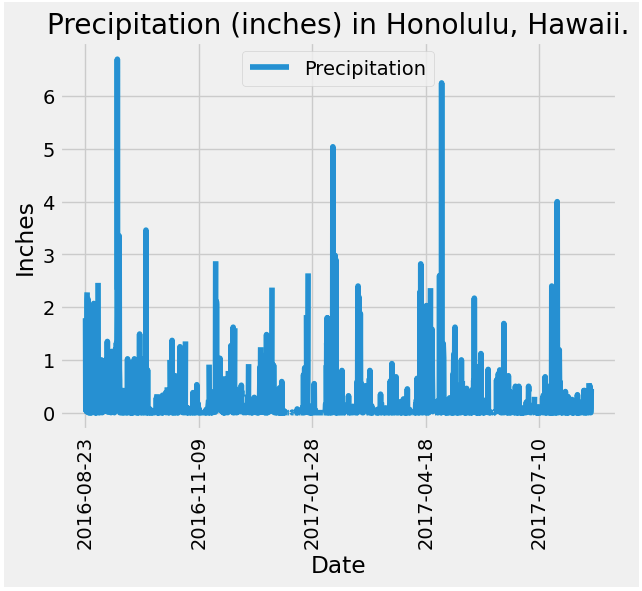
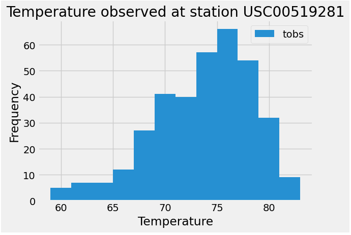
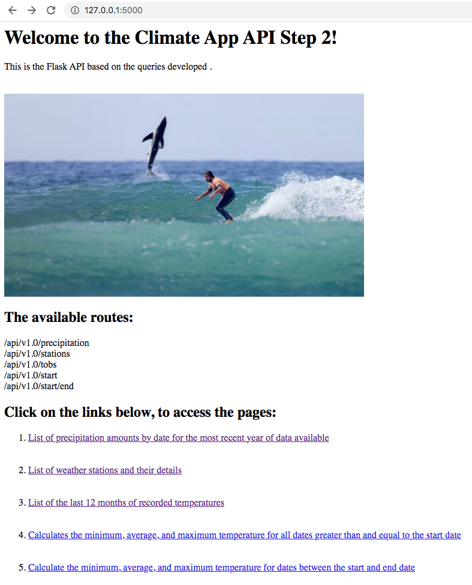

# 
 <ins>SQLalchemy-challenge</ins>

## <ins>Background</ins>

After working hard, I have decided to treat myself to a long holiday vacation in Honolulu, Hawaii. To help with my trip planning, I decided to do a climate analysis about the area. The following sections outline the steps that I took to accomplish this task.

## <ins>Part 1: Analyze and Explore the Climate Data</ins>
In this section, I used Python and SQLAlchemy to do a basic climate analysis and data exploration of my climate database. Specifically, I used SQLAlchemy ORM queries, Pandas, and Matplotlib. To do so, I completed the following steps:

1. I used `climate_starter.ipynb` and `hawaii.sqlite` files to complete my climate analysis and data exploration.

2. Next, I used the SQLAlchemy `create_engine()` function to connect to my SQLite database.

3. After, I used the SQLAlchemy `automap_base()` function to reflect my tables into classes, and then saved references to the classes named `station` and `measurement`.

4. Finally, I linked Python to the database by creating a SQLAlchemy session.

5. Once this was all completed, I performed a precipitation analysis and then a station analysis by completing the steps in the following two subsections.

  
  ### <ins>Percipitation Analysis</ins>

  * A query is designed to retrieve the last 12 months of precipitation data, and only the `date` and `prcp` values is selected.

* The query results also loded into a Pandas DataFrame and the index is seted in to the date column, and sorted the DataFrame values by `date`.

* Finally the result ploted by using the DataFrame `plot` method.See image below:

 

* By using the Pandas the summary statistics for the precipitation data was performed, and displayed. 
  

  ### <ins>Station Analysis</ins>

* A query is designed to calculate the total number of stations, and 9 stations found. Station `USC00519281` has the highest number of observations.

* A query is created to retrieve the last 12 months of temperature observation data (TOBS) and filter by the station with the highest number of observations. The Plot for the results as a histogram with `bins=12` were created, See image below. 

- - -

  ## <ins>Step 2 Climate App</ins>

  

  
After completing step 1, a Flask API was designed which was based on the queries already developed.

The following routes were created by using the Flask, which can be seen in the above image. 

###  Routes

* `/`

  * Home page.

  * List all routes that are available.

* `/api/v1.0/precipitation`

  * Convert the query results to a dictionary using `date` as the key and `prcp` as the value.

  * Return the JSON representation of your dictionary.

* `/api/v1.0/stations`

  * Return a JSON list of stations from the dataset.

* `/api/v1.0/tobs`
  * Query the dates and temperature observations of the most active station for the last year of data.
  
  * Return a JSON list of temperature observations (TOBS) for the previous year.

* `/api/v1.0/<start>` and `/api/v1.0/<start>/<end>`

  * Return a JSON list of the minimum temperature, the average temperature, and the max temperature for a given start or start-end range.

  * When given the start only, calculate `TMIN`, `TAVG`, and `TMAX` for all dates greater than and equal to the start date.

  * When given the start and the end date, calculate the `TMIN`, `TAVG`, and `TMAX` for dates between the start and end date inclusive.
